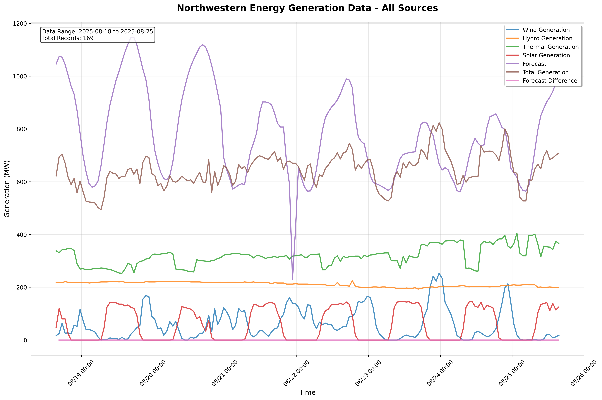

# Northwestern Energy Generation Data

## Current Generation Data Visualization

*Last updated: 2025-08-25 17:41:16 UTC*

This plot shows all available generation data from Northwestern Energy including:
- Wind Generation
- Hydro Generation  
- Thermal Generation
- Solar Generation
- Forecast Data
- Total Generation
- Forecast Difference

Data is automatically collected and updated from Northwestern Energy's public API.

